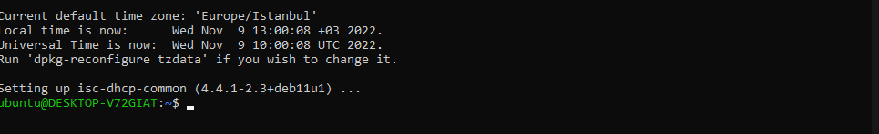

# Linux 101 Eğitimi İçin Yapılması Gerekenler

Eğitime gelirken bilgisayarınızı getirmeniz uygulama kısmı için gereklidir

Ayrıca teori kısmı için bir notepad getirmeniz sizin yararınıza olacaktır

## Eğitime gelinmeden önce yapılması gerekilenler
Eğer windows kullanıyorsanız bilgisyarınıza WSL kurmanız yeterli olacaktır.

**BU ADIMLARDA  İNTERNET BAĞLANTISINA İHTİYACINIZ BULUNUYOR**

Bunun için bilgisayarınızda powershell'i administrator yetkileri(Yünetici Yetkisi) ile resimdeki gibi açmanız ve aşağdaki komutu girmeniz gereklidir, bu şekilde makinenize WSL kurulacaktır.

```PowerShell
wsl --install   
```
Bu adım sonrası bir süre makinanız WSL'i kuracaktır ve otomatik olarak WSL Ubuntu dağıtımını kuracaktır.

Bu adımlardan sonra makinenizi yeniden başlatmanız gerekiyor. Yeniden başlattıktan sonra sonraki adıma geçebilirsiniz

Önümüzdeki adımda kullanıcı adı ve şifre tanımlamaları yapıcaksınız, burda eğitim amacıyla

**isim olarak :ubuntu**

**şifre olarak :ubuntu**

kullanmanızı rica ediyorum. Bunları sonradan değiştirmek kolay.

Sonraki adımda bilgisayarınızı açtığınızda aşağıdaki gibi bir ekranlan karşılaşacaksınız:


Burada **Enter new UNIX username:** yazan yere istediğiniz ismi **Türkçe karakter kullanmadan** seçebilirsiniz. Ardından sizden şifre belirlemeniz istenecek.


Burda şifre belirlerken dikkat etmeniz gereken şey, siz şifrenizi yazsanız dahi terminalde herhegi birşey gözükmeyecek olmasıdır. Buna takılmayın, gizlilik amacıyla şifreler terminalde gözükmez. 


Örnek vermek gerekirse yukarıda ben şifremi 'ubuntu' olarak belirledim ancak gözükmüyor. Burda şifrenizi yazdıktan sonra enter'a basmanız yeterlidir. Burada şifrenizin de Türkçe karakter içermemesine dikkat ediniz.

Ardından **Retype your password:**  görünecektir ekranınızda. Şifrenizi ilk girdiğinizdeki durum burda da geçerli. Bir önceki adımda koyduğunuz şifreyi kullanınız burda da.

Bu adımlardan sonra aşağıdaki gibi bir ekran ile karşılaşacaksınız.


Bu noktada WSL sanal makina kurulumunuz tamamlanmış bulunmaktadır. Şimdi gerekli uygulamaları kuracağız.
```bash
sudo apt update && sudo apt upgrade
```
Bu komut ile uygulamalar kurulmadan önce sistemimizi güncelleştiriyoruz.

Önünüze aşağıdaki gibi bir ekran çıkacak ve şifreniz istenecek, burda belirlediğiniz şifrenizi giriniz. Burada benim dediğim gibi root yaptıysanız başta şifrenizi onu kullanmanız gerekir.


Ardından aşağıdaki gibi sizden güncellemeyi yapmak isteyip istemdiğiniz sorulacak, buna **Y** giriniz ve enter'a basınız.

Ardından güncelleme tamamlandığı zaman aşağıdaki gibi bir ekran gelicek önünüze. Burdan sonra kullanacağımız programları kuracağız aşağıdaki komut ile:

Aşağıdaki komutu giriniz terminalinize:
```bash
sudo apt install htop man vim wget zip curl
```
Burada da şifreniz sorulur ise giriniz ve **Do you want to continue** soruna **Y** cavabını veriniz
